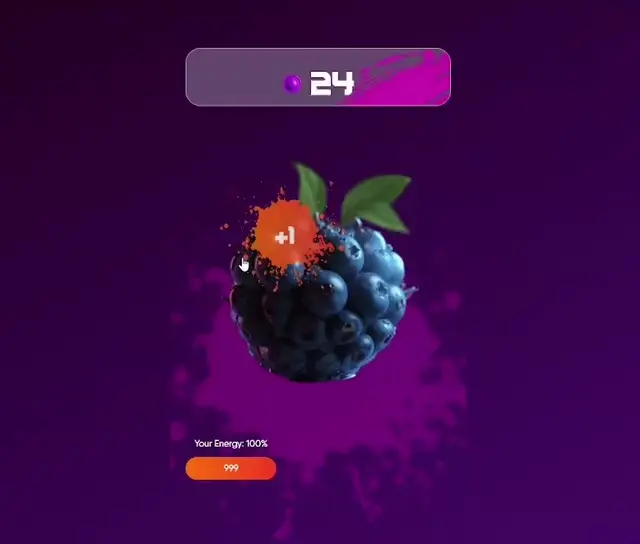

**Запуск:**
 - npm install
 - docker-compose up --build

**Стек:** 
WebApp, React + TS, Vite, SCSS, Axios, Zustand

**Проект:**
Сделать базовый кликер на telegram mini-apps

**Экран:**
Состоит из поля на котором выведен баланс, фрукт на который необходимо нажать, уровень энергии в доступе у игрока.

**Функционал:**
При клике на фрукт увеличивается баланс на 1 монету и уменьшается энергия на 1. 
При энергии меньше единицы тапать на фрукт нельзя.
Энергия беспрерывно отрастает до изначального состояния. (на одну единицу в секунду).

**Бэкенд:**
Для получения данных использовать вызовы к API
Бэкенд нужно развернуть локально через docker compose, инструкция в readme.md
https://gitlab.itworkin.com/itworkin_public/test_frontend.git

**Дизайн:**
[https://www.figma.com/design/HM8wsuQgdV4in7jK6aTc4G/Wild-Тапалка-(Copy)?node-id=23-5174&t=uCxkFAyEPEmG6Mfl-0](https://www.figma.com/design/HM8wsuQgdV4in7jK6aTc4G/Wild-%D0%A2%D0%B0%D0%BF%D0%B0%D0%BB%D0%BA%D0%B0-(Copy)?node-id=23-5174&t=uCxkFAyEPEmG6Mfl-0)

**Демо:**

